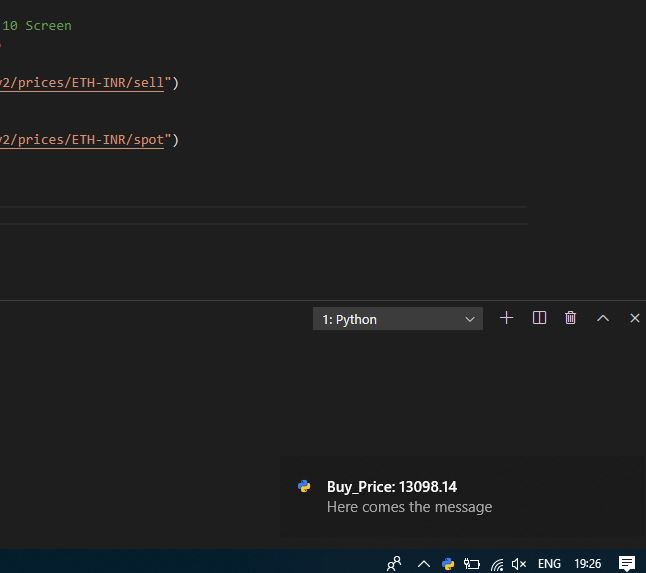
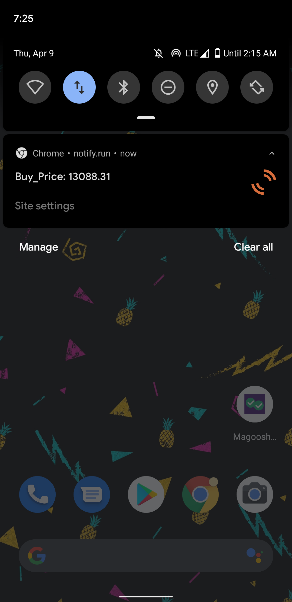

# Coinbase_Price_fetcher
I have written script for ETH/INR, you can change this in code
This Script is used to get the Buy, Sell, Spot Prices from the Coinbase API and can send notifications to Mobile and Desktop

# Desktop Screenshot

# Mobile Screenshot

# Requirements
Download these before using:
requests,
notify-run,
win10toast.
